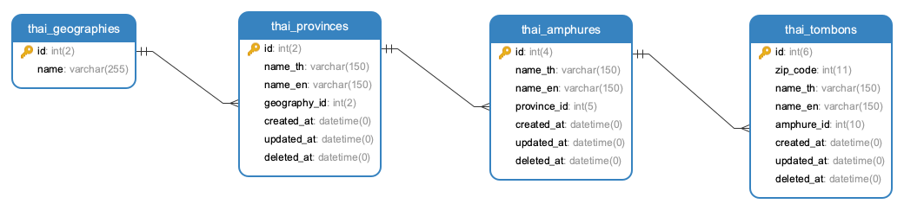

## ข้อมูลจังหวัด อำเภอ ตำบล ของประเทศไทย

### ข้อมูลประกอบด้วยรูปแบบ
- csv
- json
- sql
- xlsx
- xml

### API JSON ไฟล์สำหรับใช้งาน
- (ทั้งหมด) https://raw...master/api_province_with_amphure_tambon.json
- (จังหวัด) https://raw...master/api_province.json
- (อำเภอ) https://raw...master/api_amphure.json
- (ตำบล) https://raw...master/api_tambon.json
- (ทั้งหมด แบบย้อนกลับ) https://raw...master/api_revert_tambon_with_amphure_province.json

